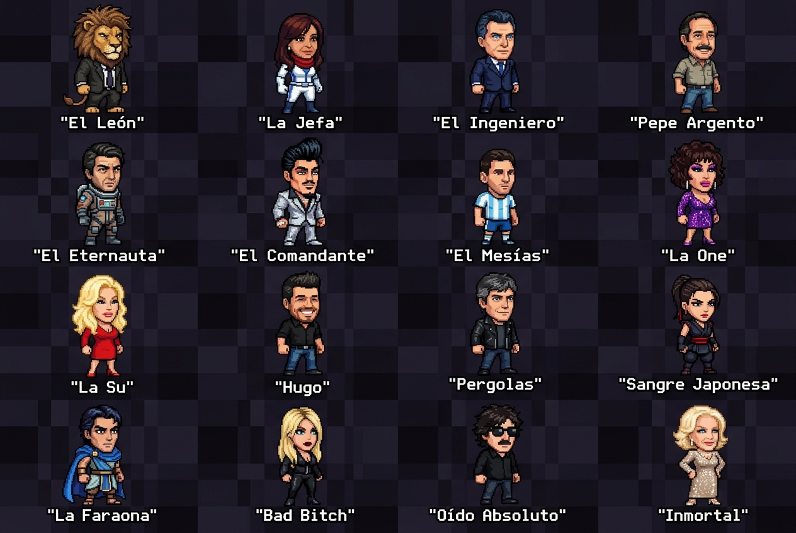

# 🇦🇷 TORNEO ARGENTO 16-BIT: La Batalla Final

Videojuego de peleas arcade estilo retro de 16-bits (Mortal Kombat / Street Fighter) protagonizado por 16 personajes icónicos de la cultura, política, televisión y música argentina.



---

## 🎮 Características del Juego

- **Roster de 16 Luchadores Argentinos**: Cada uno con habilidades únicas, poderes temáticos, combos y Fatalities.
- **Motor de Sprites en Alta Definición**: Hojas de sprites estandarizadas (768 x 1600 px) con animaciones fluidas (Idle, Caminar, Salto, Agacharse, Bloqueo, Golpes, Patadas, Poderes Especiales, Dizzy, Derrota y Victoria).
- **Estudio de Sprites GSAP**: Herramienta interactiva para previsualizar fotogramas, probar físicas cinéticas, modos de animación cuadro a cuadro y combos coreografiados.
- **Modos de Juego**:
  - 🏆 **Torre Arcade**: Enfréntate a toda la jerarquía de luchadores hasta la Jefa Final.
  - ⚔️ **Duelo Versus**: Pelea 1 vs 1 local o contra la CPU con múltiples niveles de dificultad.
- **Efectos Visuales**: Filtro CRT vintage con líneas de barrido de monitor arcade, sacudidas de pantalla, partículas de chispas y confeti.
- **Banda Sonora de Rock Nacional**: Música retro inspirada en clásicos del rock argentino (Soda Stereo, Charly García, Ataque 77, etc.).

---

## 🕹️ Controles del Teclado

Los controles están diseñados ergonómicamente alrededor de las flechas y el bloque de navegación:

### 🔴 Movimiento del Personaje (Flechas)
- **`←` (Flecha Izquierda)**: Moverse a la izquierda / retroceder
- **`→` (Flecha Derecha)**: Moverse a la derecha / avanzar
- **`↑` (Flecha Arriba)**: Saltar
- **`↓` (Flecha Abajo)**: Agacharse

### 🔵 Bloque de Acciones y Combate (Navegación)
| Tecla | Acción | Descripción |
| :--- | :--- | :--- |
| **`Insert`** | **Golpe Liviano** | Jab rápido para conectar combos |
| **`Inicio` (Home)** | **Golpe Pesado** | Gancho o patada de gran impacto |
| **`Supr` (Delete)** | **Cubrirse / Bloqueo** | Reduce el daño recibido un 80% mientras se mantiene presionado |
| **`Fin` (End)** | **Poder Especial 1** | Poder característico del personaje |
| **`Av Pág` (PageDown)** | **Poder Especial 2** | Proyectil secundario o trampa |
| **`Despl Bloq` / `Impr Pant`** | **Poder Especial 3** | Poder especial de apoyo |
| **`Re Pág` (PageUp)** | **Ataque Súper** | Ataque cinemático con la barra de energía al 100% |
| **`Pausa` / `Esc`** | **Menú de Pausa** | Pausa la pelea y muestra la lista de movimientos |

### ⚡ Combos Direccionales
- **`↓` + `Insert`**: Especial 1
- **`↓` + `Inicio`**: Especial 2
- **`↓` + `Fin`**: Especial 3
- **`FATALITY`**: Al finalizar la ronda, presiona cualquier tecla de acción (`Fin`, `Re Pág`, `Supr`, `Insert`) para desatar la Fatality.

---

## 👥 Roster Completo de Luchadores

1. 🦁 **El León** *(Javier Milei)*: Mordisco Salvaje, Zarpazo Felino, Rugido de la Selva.
2. 🏛️ **La Tina** *(Cristina Fernández)*: Rayo Solar de Mayo, Lluvia de Pirámides, Cadena Nacional.
3. 🐱 **Ojos Azules** *(Mauricio Macri)*: Lanzamiento Gatuno, Estampida de Gatitos, Globo Amarillo.
4. 👟 **Pepe Argento** *(Guillermo Francella)*: Furia Racing Club, Zapatazo Rabioso, Pistola de Píxeles.
5. ❄️ **El Eternauta** *(Juan Salvo)*: Nevada Mortal Criogénica, Monolito de Hielo, Voxel Barrier.
6. 💵 **El Comandante** *(Ricardo Fort)*: Tormenta de Billetes, Lluvia de Oro, Rolls Royce Dash.
7. ⚽ **El Mesías** *(Lionel Messi)*: Tiro Libre Chanfle 10, Gambeta Cósmica, Balón de Oro Cannon.
8. 🪶 **La One** *(Moria Casán)*: Uñas de Acero, Látigo de Cabellera, Lengua Karateka.
9. ☎️ **La Su** *(Susana Giménez)*: Tormenta de Sol Radiante, Teléfono de Oro, Llamado Millonario.
10. 🚛 **Hugo** *(Camioneros)*: Bocinazo Sísmico, Bloqueo de Ruta, Embestida Scania.
11. 🕶️ **Pérgolas** *(Mario Pergolini)*: Ataque CQC, Interferencia de Radio, Antena Satelital.
12. ⚔️ **Sangre Japonesa** *(China Suárez)*: Estocada Katana, Pétalos de Cerezo, Danza Samurai.
13. 👑 **La Faraona** *(Martín Cirio)*: Lanzamiento de Maíz, Invocación de Gallinas Cluecas, Rayo Faraónico.
14. 💅 **Bad Bitch** *(Wanda Nara)*: Bomba de Glitter, Cartera Louis Strike, Mina Antipersona VIP.
15. 🎹 **Oído Absoluto** *(Charly García)*: Acorde de Piano Gigante, Riff de Guitarra, Synth Wave.
16. 👑 **La Inmortal** *(Mirtha Legrand - Jefa Final)*: Levitación de Vajilla y Sillas, Rayos de la Inmortalidad, Mesaza Table Smash.

---

## 🚀 Cómo Jugar

Simplemente abre el archivo `index.html` en cualquier navegador web moderno, o ejecuta:

```bash
# Opción con doble clic en Windows:
iniciar_juego.bat

# O sirviendo los archivos estáticos con Node:
node scripts/serve.js
# Luego abre: http://localhost:3000/
```

---

## 🛠️ Tecnologías Utilizadas

- **HTML5 & Vanilla JavaScript**: Lógica de motor de juego 2D, colisiones y estado.
- **HTML5 Canvas 2D**: Renderizado pixel-perfect a resolución nativa con escalado suave.
- **GSAP 3 (GreenSock Animation Platform)**: Física cinética, cinemáticas y Estudio de Sprites.
- **Web Audio API**: Efectos de sonido sintetizados y reproducción multicanal.
